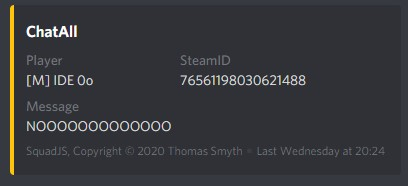

<div align="center">


#### SquadJS - Discord Chat Plugin
</div>

## About
The Discord Chat plugin streams in-game chat to a Discord channel. It is useful to allow those out of game to monitor in-game chat as well as to log to permanent form. It can be configured to limit access to specific chats.

## Requirements
 * Discord bot setup & login token placed in `core/config.js` file.

## Installation
Place the following into your `index.js` file. The options below are optional and can be removed without affecting functionality, however, the default values are shown below for reference.
```js
await discordChat(
  server, 
  'discordChannelID', 
  { // options
    ignoreChats: ['ChatSquad', 'ChatAdmin'], // an array of chats to not display
    color: 16761867 // color of embed
  }
); 
```

## Example

